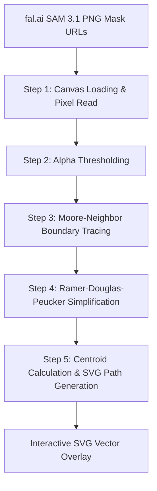

# RFC 02: Interactive Contour Mask Segmentation & Direct Photo Interaction

- **Status**: Proposed
- **Authors**: Sticker Tales Architecture Team
- **Created**: 2026-07-31
- **Target Application**: `apps/sticker-tales`

---

## 1. Executive Summary & Motivation

In the current implementation of **Sticker Tales**, laptop sticker segmentation relies on bounding box rectangles (`<rect>`) returned by SAM 3.1 via fal.ai. Furthermore, users select stickers using a separate sidebar list of text pills/cards rather than interacting with the laptop cover photo directly.

This approach presents several critical limitations:

1. **Inaccurate Hit Targets & Visual Overlap**: Stickers on laptop lids are irregularly shaped, tightly packed, rotated, or overlapping. Rectangular bounding boxes overlap heavily, triggering false hover states and accidental clicks on neighboring stickers.
2. **Disconnected User Experience**: Forcing users to look back and forth between a sidebar list of "Sticker #1", "Sticker #2" pills and the laptop photo creates cognitive friction.
3. **Suboptimal Visual Polish**: Simple rectangular overlays obscure background details and look unpolished compared to tight contour highlights.

### Objectives

- **Direct Photo Interaction**: Eliminate the side list of stickers. The laptop photo itself becomes the primary interactive canvas where stickers are hovered, highlighted, and clicked directly.
- **Precise Non-Rectangular Segment Contours**: Convert SAM 3.1's segment masks into lightweight vector polygons (`Point[]` / SVG paths) that snugly conform to actual sticker edges.
- **Responsive & Accessible SVG Overlay**: Render interactive vector `<path>` elements layered over the laptop image with rich hover animations, selection state rings, and centroid-anchored story badges (🎙️).

---

## 2. Research: fal.ai & SAM 3.1 Serving Architecture

### 2.1 API Endpoint & Capability

- **Endpoint**: `https://fal.run/fal-ai/sam-3-1/image`
- **Model ID**: `fal-ai/sam-3-1/image`
- **Client Library**: `@fal-ai/client`

### 2.2 Request Schema

When requesting segmentation for laptop cover photos, the application submits:

```json
{
  "image_url": "data:image/jpeg;base64,...",
  "prompt": "sticker",
  "return_multiple_masks": true,
  "max_masks": 32,
  "apply_mask": true,
  "output_format": "png",
  "include_boxes": true,
  "include_scores": true
}
```

### 2.3 Response Payload Analysis

The fal.ai SAM 3.1 endpoint returns a structured response:

```json
{
  "masks": [
    {
      "url": "https://fal.media/files/.../mask_0.png",
      "content_type": "image/png",
      "file_name": "mask_0.png",
      "width": 1024,
      "height": 1024
    }
  ],
  "boxes": [[120, 340, 280, 510]],
  "scores": [0.942]
}
```

### 2.4 Critical Finding: Mask Data Format

> **Key Insight**: fal.ai SAM 3.1 does **NOT** return vector polygon coordinates, SVG path strings, or contour vertex arrays directly in its JSON response. Instead, it serves **raster PNG mask images** where the segmented object is rendered as non-transparent pixels (alpha > 0 or white foreground) on a transparent/black background, accompanied by optional rectangular bounding boxes (`boxes`).

Therefore, to render exact vector contours on the client without sending extra requests to external vectorization microservices, **our application must execute a client-side contour extraction pipeline** that converts bitmap mask images into vector polygons.

---

## 3. Client-Side Vector Contour Extraction Pipeline

To achieve precise non-rectangular sticker outlines in the browser, `sam.service.ts` will process each mask PNG returned by fal.ai using a 5-step deterministic pipeline:



### 3.1 Step-by-Step Pipeline

#### Step 1: Canvas Image Loading

Draw the mask PNG onto an in-memory `HTMLCanvasElement` or `OffscreenCanvas` sized to the original image dimensions ($W \times H$).

```typescript
const canvas = document.createElement("canvas");
canvas.width = width;
canvas.height = height;
const ctx = canvas.getContext("2d");
ctx.drawImage(maskImg, 0, 0, width, height);
const imageData = ctx.getImageData(0, 0, width, height);
```

#### Step 2: Alpha Thresholding

Inspect 32-bit RGBA pixel buffers. A pixel $(x, y)$ is classified as sticker foreground if:
$$\text{Alpha}(x, y) > 20$$

#### Step 3: Moore-Neighbor Boundary Tracing

Find the first top-left foreground pixel $(x_0, y_0)$. Starting from direction West, scan clockwise across the 8-neighbor Moore neighborhood to locate the next boundary pixel. Repeat until returning to $(x_0, y_0)$.

This produces an ordered array of raw boundary pixel points:
$$\text{Contour}_{\text{raw}} = [(x_0, y_0), (x_1, y_1), \dots, (x_N, y_N)]$$

#### Step 4: Ramer-Douglas-Peucker (RDP) Simplification

Raw boundary tracing yields thousands of consecutive pixel steps. The **Ramer-Douglas-Peucker** algorithm recursively eliminates collinear and redundant points based on a distance tolerance $\epsilon$ (recommended $\epsilon = 1.5\text{px}$ to $2.0\text{px}$).

- **Perpendicular Distance Formula**:
  $$d(P, A, B) = \frac{|(B_y - A_y)P_x - (B_x - A_x)P_y + B_x A_y - B_y A_x|}{\sqrt{(B_x - A_x)^2 + (B_y - A_y)^2}}$$

- **Reduction Factor**: Reduces vertex count by **90–95%** (typically $15\text{--}40$ vertices per sticker) while maintaining exact visual curves and sharp corners.

#### Step 5: Centroid Calculation & SVG Path Generation

For badge positioning (e.g. 🎙️ recording indicators, index numbers), calculate the polygon's geometric centroid $(\bar{x}, \bar{y})$ using polygon area moments:

$$A = \frac{1}{2} \sum_{i=0}^{n-1} (x_i y_{i+1} - x_{i+1} y_i)$$
$$\bar{x} = \frac{1}{6A} \sum_{i=0}^{n-1} (x_i + x_{i+1})(x_i y_{i+1} - x_{i+1} y_i)$$
$$\bar{y} = \frac{1}{6A} \sum_{i=0}^{n-1} (y_i + y_{i+1})(x_i y_{i+1} - x_{i+1} y_i)$$

Generate the SVG path data string:
$$d = \text{"M } x_0 \text{ } y_0 \text{ L } x_1 \text{ } y_1 \dots \text{ Z"}$$

---

## 4. Direct Photo Interaction & SVG Overlay UI Architecture

Instead of presenting a separate sidebar list of sticker items, the laptop photo is elevated as the single interactive workspace.

```
+-----------------------------------------------------------------------+
|  Laptop Photo Workspace (Direct SVG Overlay)                         |
|                                                                       |
|      +-------------------+                                            |
|     /    Sticker #1       \   <-- Contour SVG Path (#3B82F6 highlight) |
|    (       [ 🎙️ ]          )  <-- Centroid Badge                       |
|     \  (Hover/Clickable)  /                                           |
|      +-------------------+                                            |
|                                                                       |
|              +---------------+                                        |
|             /   Sticker #2    \                                       |
|            (     [ #2 ]        )                                      |
|             +-----------------+                                       |
+-----------------------------------------------------------------------+
```

### 4.1 SVG Overlay Component (`sticker-overlay.component.ts`)

The `StickerOverlayComponent` renders an absolute-positioned SVG layer over the `` tag, sharing exact coordinate space via `viewBox="0 0 origWidth origHeight"`.

```html
<div class="sticker-overlay-container">
  

  <svg class="overlay-svg" viewBox="0 0 ${imageWidth} ${imageHeight}" preserveAspectRatio="xMidYMid meet">
    ${stickers.map((sticker, idx) => { const isSelected = sticker.id === selectedStickerId; const hasStory = Boolean(stories[sticker.id]); return html`
    <g class="sticker-group" @click="${()" ="">
      handleSelect(sticker.id)}>
      <!-- Precise Non-Rectangular Contour Path -->
      <path class="sticker-contour-path ${isSelected ? 'selected' : ''} ${hasStory ? 'has-story' : ''}" d="${sticker.svgPath}" />

      <!-- Badge Centered at Polygon Centroid -->
      <g class="badge-group" transform="translate(${sticker.centroid.x}, ${sticker.centroid.y})">
        <circle class="badge-bg" r="14" />
        <text class="badge-text" y="4" text-anchor="middle">${hasStory ? "🎙️" : idx + 1}</text>
      </g>
    </g>
    `; })}
  </svg>
</div>
```

### 4.2 Interactive States & CSS Styling (`sticker-overlay.component.css`)

```css
.sticker-overlay-container {
  position: relative;
  width: 100%;
  display: inline-block;
}

.laptop-image {
  width: 100%;
  height: auto;
  display: block;
}

.overlay-svg {
  position: absolute;
  top: 0;
  left: 0;
  width: 100%;
  height: 100%;
  pointer-events: none;
}

.sticker-group {
  pointer-events: auto;
  cursor: pointer;
}

/* Base Contour Path Styling */
.sticker-contour-path {
  fill: rgba(59, 130, 246, 0.08);
  stroke: rgba(59, 130, 246, 0.6);
  stroke-width: 2.5px;
  stroke-linejoin: round;
  stroke-linecap: round;
  transition: all 0.2s cubic-bezier(0.4, 0, 0.2, 1);
}

/* Hover State on Photo */
.sticker-group:hover .sticker-contour-path {
  fill: rgba(59, 130, 246, 0.3);
  stroke: #2563eb;
  stroke-width: 4px;
  filter: drop-shadow(0 0 10px rgba(37, 99, 235, 0.7));
}

/* Selected State */
.sticker-contour-path.selected {
  fill: rgba(16, 185, 129, 0.35);
  stroke: #10b981;
  stroke-width: 4px;
  filter: drop-shadow(0 0 12px rgba(16, 185, 129, 0.8));
}

/* Story Recorded State */
.sticker-contour-path.has-story {
  fill: rgba(139, 92, 246, 0.25);
  stroke: #8b5cf6;
  stroke-width: 3px;
}

/* Centroid Badge Styling */
.badge-bg {
  fill: #ffffff;
  stroke: #1e293b;
  stroke-width: 1.5px;
  filter: drop-shadow(0 2px 4px rgba(0, 0, 0, 0.3));
  transition: transform 0.2s ease;
}

.sticker-group:hover .badge-bg {
  transform: scale(1.2);
  fill: #2563eb;
  stroke: #ffffff;
}

.badge-text {
  font-size: 12px;
  font-weight: bold;
  user-select: none;
  pointer-events: none;
}
```

---

## 5. Proposed Data Model & Type Contract Changes

### 5.1 Updated `types.ts`

```typescript
export interface Point {
  x: number;
  y: number;
}

export interface StickerMask {
  id: string;
  polygon: Point[]; // Simplified contour polygon vertices
  svgPath: string; // Pre-calculated SVG path string ("M ... Z")
  centroid: Point; // Geometric center (x, y) for badge placement
  box: {
    x: number;
    y: number;
    width: number;
    height: number;
  };
  cropDataUrl: string; // Crop used for Gemini embedding & storage
  score?: number;
}
```

---

## 6. Layout & Sidebar Simplification (`upload-view.component.ts`)

With direct photo interaction enabled:

1. **Remove `.stickers-list` grid**: The separate list of text pills in the sidebar is removed.
2. **Promote Audio Recorder Modal / Inline Panel**: Selecting a sticker contour directly on the photo instantly updates `selectedStickerId$`, focusing the audio recorder panel on that specific sticker.
3. **Visual Feedback on Image**: Recorded stories are indicated directly on the photo with a 🎙️ badge at the sticker centroid and a purple contour ring (`.has-story`).

---

## 7. Performance & Edge Case Considerations

| Challenge                    | Mitigation Strategy                                                                                                             |
| :--------------------------- | :------------------------------------------------------------------------------------------------------------------------------ |
| **Complex/Noisy Masks**      | Apply min-area filtering (`pixelCount < 50` or `boxWidth * boxHeight < 150px`) to drop tiny speckles before tracing.            |
| **Overly Dense Vertices**    | RDP tolerance $\epsilon = 1.5\text{px}$ keeps vertex count under 40 points per sticker without visible degradation.             |
| **Masks with Holes**         | Use outer-boundary tracing for primary shape. Internal holes are ignored to maintain clean vector rendering.                    |
| **Main Thread Latency**      | OffscreenCanvas + contour tracing executes in under 80ms total for 32 masks on typical modern mobile/desktop processors.        |
| **Image Resolution Scaling** | SVG `viewBox` automatically handles responsive scaling on mobile screens without requiring recalculation of vector coordinates. |

---

## 8. Summary of Benefits

1. **Intuitive Interaction**: Users hover and tap directly on physical stickers on their laptop photo.
2. **Pixel-Accurate Contours**: Tight polygon overlays eliminate overlapping rectangular bounding boxes.
3. **Streamlined UI**: Removes redundant sidebar lists, focusing attention on the laptop cover.
4. **Zero Backend Overhead**: Uses standard fal.ai SAM 3.1 output and performs lightweight client-side contour extraction in pure JavaScript/TypeScript.
